---
# You can also start simply with 'default'
theme: dracula
# random image from a curated Unsplash collection by Anthony
# like them? see https://unsplash.com/collections/94734566/slidev
background: /images/bg.svg
# some information about your slides (markdown enabled)
title: Conversational AI on Ubuntu
info: |
  ## Conversational AI on Ubuntu
  Local Implementation with Vocode.

  Learn more at [arpagon/ubuconla-2024-conversational-ai](https://github.com/arpagon/ubuconla-2024-conversational-ai)
# apply unocss classes to the current slide
class: text-center
# https://sli.dev/features/drawing
drawings:
  persist: false
# slide transition: https://sli.dev/guide/animations.html#slide-transitions
transition: slide-left
# enable MDC Syntax: https://sli.dev/features/mdc
mdc: true
---

# IA Conversacional en Ubuntu

Implementación Local con Vocode.


<div class="pt-12">
  <span @click="$slidev.nav.next" class="px-2 py-1 rounded cursor-pointer" hover="bg-white bg-opacity-10">
    Presiona Espacio <carbon:arrow-right class="inline"/>
  </span>
</div>

<div class="absolute bottom-0 left-0 right-0 p-6 flex justify-between items-center">
  
  <a href="https://github.com/arpagon/ubuconla-2024-conversational-ai" target="_blank" alt="GitHub" title="Open in GitHub"
    class="text-xl slidev-icon-btn opacity-50 !border-none !hover:text-white">
    <carbon-logo-github />
  </a>
</div>

<!--
The last comment block of each slide will be treated as slide notes. It will be visible and editable in Presenter Mode along with the slide. [Read more in the docs](https://sli.dev/guide/syntax.html#notes)
-->

---
layout: image-left
image: 'images/me_2023_ArtisanLabs_nologo.svg'
---

# Sebastian Rojo

<div class="flex flex-col space-y-4">
  <div class="flex items-center">
    
    Socio fundador de Sapian
  </div>
  <div class="flex items-center">
    
    Open Source Engineer at Vocode
  </div>
  <div class="flex items-center">
    
    Fundador y CTO de ArtisanLabs
  </div>
  <div class="flex items-center">
    <carbon-ai-status class="w-8 mr-4" />
    Comunicación en Tiempo Real, Voice ML, ML locales y distribuidos.
  </div>
  <div class="flex items-center">
    <carbon-logo-python class="w-8 mr-4" />
    Contribuidor Activo en la Comunidad Python y de Código Abierto
  </div>
  <div class="flex items-center">
    <carbon-logo-linkedin class="w-8 mr-4" />
    <a href="https://www.linkedin.com/in/arpagon/" target="_blank">linkedin.com/in/arpagon</a>
  </div>
  <div class="flex items-center">
    <carbon-logo-x class="w-8 mr-4" />
    <a href="https://x.com/arpagon" target="_blank">@arpagon</a>
  </div>
</div>

---
layout: center
---

<div v-click>

<uil-question-circle class="text-xl text-violet-400" /> ¿Quién está interesado en escuchar sobre **IA conversacional**?

</div>

<div v-click>
<uil-question-circle class="text-xl text-violet-400" /> Dejen la mano levantada los que usan <strong>ChatGPT</strong>... </div><div v-click>pero copian y pegan sin revisar... 😂🤣</div>


<div v-click>

<uil-question-circle class="text-xl text-violet-400" /> ¿Quién ha usado asistentes de voz como Siri, Alexa o Google Assistant?

</div>

<div v-click>

<uil-question-circle class="text-xl text-violet-400" /> ¿Quién ha usado **IAs conversacionales**?

</div>

<div v-click>

<uil-question-circle class="text-xl text-violet-400" /> ¿Quién ha implementado algo con **inteligencia artificial**?

</div>

---
layout: center
---

# Por qué es esto importante

<uil-question-circle class="text-xl text-violet-400" /> ¿Cuántos trabajadores "deskless" hay en el mundo?

<div v-click>
<p>
  ¡Es más del 80%! Hay más de <span v-mark.green="4">3.5 mil millones de trabajadores</span> <strong>deskless</strong> en todo el mundo. 
  <br>
  Sin embargo, solo el <span v-mark.circle.green="4">1%</span> del software está diseñado específicamente para ellos.
</p>
</div>

<!--
Key Statistic:

3.5 Billion Workers – Over 80% of the global workforce are "deskless," meaning they don't sit at a desk to perform their job. This includes blue-collar workers, field service workers, retail employees, healthcare staff, and more.
Breakdown by Industry:

Manufacturing: 20% of the global workforce
Agriculture: 27% of the global workforce
Retail & Hospitality: 16% of the global workforce
Healthcare: 10% of the global workforce
Construction: 7% of the global workforce
Others: 20%
Key Point:

These workers are the backbone of essential industries and are increasingly leveraging technology, including conversational AI, to enhance productivity and efficiency.
-->
---
layout: image-right
image: 'images/qr_vocode_repo.svg'
class: 'mt-1'
---

<div class="flex items-center justify-center">
  
  <h1 class="text-4xl font-bold">¿Qué es Vocode?</h1>
</div>

<div class="mt-8 max-w-2xl mx-auto">
  <div class="flex items-start mb-4">
    <carbon-logo-github class="text-xl text-violet-400 mt-1 mr-2 flex-shrink-0" />
      Es una librería modular y open source que facilita la creación de aplicaciones de voz 
      basadas en modelos de lenguaje (LLM).    
  </div>
  <div class="flex items-start">
    
    Respaldado por Y Combinator, Google Ventures y otros inversores de renombre.
  </div>
  <div class="flex items-start mb-4">
    <carbon-logo-github class="text-xl text-violet-400 mt-1 mr-2 flex-shrink-0" />
    <a href="https://github.com/vocodedev/vocode-core">https://github.com/vocodedev/vocode-core</a>
  </div>
</div>

<!--
Description:

Vocode es una poderosa librería open source diseñada para facilitar la creación de agentes conversacionales que pueden procesar voz en tiempo real.
Ofrece herramientas para integrar modelos de lenguaje, conversión de texto a voz (TTS), y conversión de voz a texto (STT) en aplicaciones locales o en la nube.
Ideal para desarrolladores que buscan implementar asistentes virtuales personalizados, chatbots de voz, y otras soluciones de IA conversacional.

Key Features:
- Real-Time Voice Processing
- Extensible & Flexible
- Compatible with Local and Cloud Deployments
-->
---
layout: center
---
# Demo
---
class: px-2
---
<div class="text-center">
  <h1>Componentes</h1>
</div>
<div grid="~ cols-4 gap-4" m="t-2">
  <div>
  <div class="w-[200px] h-[200px] flex items-center justify-center rounded-lg p-4">
    <div class="w-full h-full flex items-center justify-center bg-gray-900 rounded-lg p-2 backdrop-filter backdrop-blur-sm">
      
    </div>
  </div>
  <div class="w-[200px] h-[200px] flex items-center justify-center rounded-lg p-4">
    <div class="w-full h-full flex items-center justify-center bg-black rounded-lg p-2 backdrop-filter backdrop-blur-sm">
      
    </div>
  </div>
  Speech to Text (STT)
  <br>
  Voz a Texto
  </div>
  <div>
  <div class="w-[200px] h-[200px] flex items-center justify-center rounded-lg p-4">
    <div class="w-full h-full flex items-center justify-center bg-gray-200 rounded-lg p-2 backdrop-filter backdrop-blur-sm">
      
    </div>
  </div>
  <div class="w-[200px] h-[200px] flex items-center justify-center rounded-lg p-4">
    <div class="w-full h-full flex items-center justify-center bg-black rounded-lg p-1 backdrop-filter backdrop-blur-sm">
      <div class="rounded-lg overflow-hidden">
        <video class="max-w-full max-h-full object-contain" autoplay muted loop playsinline>
          <source src="/videos/Gemma_2_mp4_hero_square_tight.mp4" type="video/mp4">
          Your browser does not support the video tag.
        </video>
      </div>
    </div>
  </div>
  Large Language Model (LLM)
  <br>
  Modelo de Lenguaje Grande
  </div>
  <div>
  <div class="w-[200px] h-[200px] flex items-center justify-center rounded-lg p-4">
    <div class="w-full h-full flex items-center justify-center bg-white rounded-lg p-2">
      
    </div>
  </div>
  <div class="w-[200px] h-[200px] flex items-center justify-center rounded-lg p-4">
    <div class="w-full h-full flex items-center justify-center bg-white rounded-lg p-2">
      
    </div>
  </div>
  Text to Speech (TTS)
  <br>
  Síntesis de Voz por Texto
  </div>
  <div>
  <div class="w-[200px] h-[200px] flex items-center justify-center rounded-lg p-4">
    <div class="w-full h-full flex items-center justify-center bg-black rounded-lg p-2">
      
    </div>
  </div>
  <div class="w-[200px] h-[200px] flex items-center justify-center rounded-lg p-4">
    <div class="w-full h-full flex items-center justify-center bg-white rounded-lg p-2">
      
    </div>
  </div>
  Backend de Orquestacion
  </div>
</div>

---
layout: center
---
# Arquitectura: Orquestación multi-modelo

```mermaid {scale: 0.5, alt: 'A simple sequence diagram'}
sequenceDiagram
    participant U as Usuario
    participant B as Backend
    participant STT as Servicio STT
    participant LLM as Modelo LLM
    participant TTS as Servicio TTS

    Note over U,TTS: La latencia depende de la ubicación geográfica de cada componente

    U->>+B: Envía audio
    B->>+STT: Envía audio para transcripción
    STT-->>-B: Devuelve texto transcrito
    B->>+LLM: Envía texto para procesamiento
    LLM-->>-B: Devuelve respuesta generada
    B->>+TTS: Envía texto para síntesis
    TTS-->>-B: Devuelve audio sintetizado
    B->>-U: Envía respuesta de audio

    Note over U,TTS: Optimización: Usar protocolos de streaming para procesar datos en tiempo real
```

---
level: 1
---

# Code

```python
async def main():
    (
        microphone_input,
        speaker_output,
    ) = create_streaming_microphone_input_and_speaker_output(
        use_default_devices=False,
    )
    # config STT, LLM, TTS
    await conversation.start()
    print("Conversation started, press Ctrl+C to end")
    signal.signal(signal.SIGINT, lambda _0, _1: asyncio.create_task(conversation.terminate()))
    while conversation.is_active():
        chunk = await microphone_input.get_audio()
        conversation.receive_audio(chunk)
```

<!--
Notes can also sync with clicks

[click] This will be highlighted after the first click

[click] Highlighted with `count = ref(0)`

[click:3] Last click (skip two clicks)
-->

---
level: 2
---

# Configigure STT

```python
    conversation = StreamingConversation(
        output_device=speaker_output,
        transcriber=DeepgramTranscriber(
            DeepgramTranscriberConfig.from_input_device(
                microphone_input,
                endpointing_config=PunctuationEndpointingConfig(),
                api_key=settings.deepgram_api_key,
            ),
        ),
```
---
level: 2
---

# Configure LLM
```python
        agent=ChatGPTAgent(
            ChatGPTAgentConfig(
                openai_api_key=settings.openai_api_key,
                initial_message=BaseMessage(text="What up"),
                prompt_preamble="""The AI is having a pleasant conversation about life""",
            )
        ),

```
---
level: 2
---

# Configure TTS
```python
        synthesizer=AzureSynthesizer(
            AzureSynthesizerConfig.from_output_device(speaker_output),
            azure_speech_key=settings.azure_speech_key,
            azure_speech_region=settings.azure_speech_region,
        ),
    )
```

---
layout: image-right
image: https://cover.sli.dev
---
# Arquitectura: multimodal model (e2e)

---
layout: center
class: text-center
---

# Learn More

[Documentación](https://vocode.dev/docs) · [GitHub](https://github.com/vocodedev/vocode-python) · [Ejemplos](https://github.com/vocodedev/vocode-python/tree/main/examples)

<PoweredBySlidev mt-10 />
